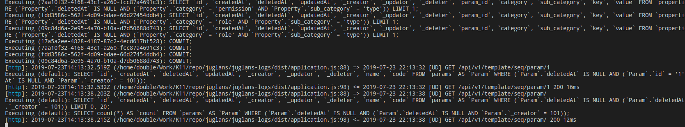
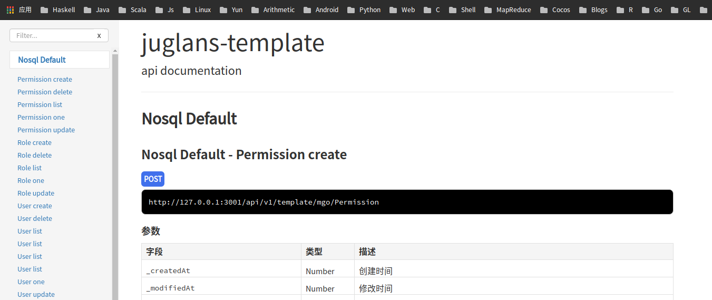

## Directory

<!-- TOC -->

- [Directory](#directory)
- [juglans-addition](#juglans-addition)
    - [mongoose addition](#mongoose-addition)
        - [Create addition](#create-addition)
        - [Use as plugin](#use-as-plugin)
        - [Custom default api if you need](#custom-default-api-if-you-need)
        - [Defined your config](#defined-your-config)
            - [Global](#global)
            - [Profile](#profile)
            - [Code](#code)
    - [sequelize addition](#sequelize-addition)
        - [Create addition](#create-addition-1)
        - [Use as plugin](#use-as-plugin-1)
        - [Custom default api if you need](#custom-default-api-if-you-need-1)
        - [Defined your config](#defined-your-config-1)
            - [Global](#global-1)
            - [Profile](#profile-1)
            - [Code](#code-1)
    - [logger](#logger)
        - [Add transport](#add-transport)
    - [redis addition](#redis-addition)
    - [apidoc](#apidoc)
        - [Install apidoc](#install-apidoc)
        - [Add ignore to .igonre file](#add-ignore-to-igonre-file)
        - [Generate apidoc](#generate-apidoc)
        - [Use apidoc plugin](#use-apidoc-plugin)
        - [Review](#review)
- [MIT License](#mit-license)

<!-- /TOC -->
## juglans-addition

        Addtion is the core of the whole structure, not only facilitate the plug-in functionality,
    but also provide multiple systems to form a unity, engineering is key for the system, such
    as the unified database access once, log form, document, etc.
### mongoose addition

    mgoext provide model Registered, mongoose and configuration of the default api
#### Create addition

```javascript
repo.mgoExt = mgo.Ext.Connect(config.mongo.uri, config.mongo.opts)
repo.mgoExt.setApiOpts({
  prefix: '/template/mgo'
})
```
#### Use as plugin
```javascript
app.PostUse(repo.mgoExt)
```

#### Custom default api if you need
```javascript
const User = mgoExt.Register({
  name: 'User',
  displayName: '参数配置',
  schema: defineSchema,
  autoHook: false
})
module.exports = function ({ router }) {
  // routes: api/v1/mgo/user
  mgoExt.api.List(router, 'User').Pre(async function (ctx) {
    console.log('before')
  }).Post(async function (ctx) {
    console.log('after')
  })
  // routes: api/v1/mgo/feature1/user
  mgoExt.api.Feature('feature1').List(router, 'User')
  // routes: api/v1/mgo/feature1/subFeature1/user
  mgoExt.api.Feature('feature1').Feature('subFeature1').List(router, 'User')
  // routes: api/v1/mgo/custom/user
  mgoExt.api.Feature('feature1').Feature('subFeature1').Name('custom').List(router, 'User')

  mgoExt.api.One(router, 'User')
  mgoExt.api.Delete(router, 'User')
  mgoExt.api.Update(router, 'User')
  mgoExt.api.Create(router, 'User')
}
```
#### Defined your config
	Configure the priority levels
		Global < Profile < Code
##### Global
```javascript
repo.mongoose = mgo.mongoose
repo.mgoExt = mgo.Ext.Connect(config.mongo.uri, config.mongo.opts)
repo.mgoExt.setApiOpts({
  prefix: '/template/mgo'
})
```
##### Profile
```javascript
mgoExt.Register({
  name: 'User',
  displayName: '参数配置',
  schema,
  opts: {
    routeHooks: {
      list: {
        cond: async function (cond, ctx, opts) {
          return cond
        }
      }
    }
  },
  autoHook: false
})
```

##### Code
```javascript
mgoExt.api.List(router, 'User')
  .Pre(async function (ctx) {
    console.log('before')
  })
  .Post(async function (ctx) {
    console.log('after')
  })
```

### sequelize addition

#### Create addition

```javascript
// sequelize init
repo.Sequelize = seq.Sequelize
repo.SeqExt = seq.Ext.Connect(config.sql.uri, config.sql.opts)
repo.SeqExt.setApiOpts({
})
```
#### Use as plugin
```javascript
app.PostUse(repo.SeqExt)
```

#### Custom default api if you need

```javascript
const User = SeqExt.Register({
  schema: defineSchema,
  name: 'user',
  displayName: '用户',
  autoHook: false,
  opts: {}
})

User.belongsTo(User, {foreignKey: '_creator', as: 'creator'})
User.belongsTo(User, {foreignKey: '_modifier', as: 'modifier'})

module.exports = ({ router, events: e }) => {
  // routes: api/v1/mgo/user
  SeqExt.api.List(router, 'user').Pre(async function (ctx) {
    console.log('before')
  }).Post(async function (ctx) {
    console.log('after')
  })
  // routes: api/v1/mgo/feature1/user
  SeqExt.api.Feature('feature1').List(router, 'user')
  // routes: api/v1/mgo/feature1/subFeature1/user
  SeqExt.api.Feature('feature1').Feature('subFeature1').List(router, 'user')
  // routes: api/v1/mgo/custom/user
  SeqExt.api.Feature('feature1').Feature('subFeature1').Name('custom').List(router, 'user')
  SeqExt.api.One(router, 'user')
  SeqExt.api.Delete(router, 'user')
  SeqExt.api.Update(router, 'user')
  SeqExt.api.Create(router, 'user')
}
```
#### Defined your config
	Configure the priority levels
		Global < Profile < Code
##### Global
```javascript
repo.SeqExt.setApiOpts({
  prefix: '/template/seq',
  routeHooks: {
    one: {
      cond: function (cond, ctx, info) {
        const token = ctx.state['token']
        if (token) {
          cond._creator = token.extra.id
        }
        return cond
      }
    },
    list: {
      cond: function (cond, ctx, info) {
        const token = ctx.state['token']
        if (token) {
          cond._creator = token.extra.id
        }
        return cond
      }
    },
    create: {
      form: function (form, ctx, info) {
        const token = ctx.state['token']
        if (token) {
          form._creator = token.extra.id
        }
        return form
      }
    },
    delete: {
      cond: function (cond, ctx, info) {
        const token = ctx.state['token']
        if (token) {
          cond._creator = token.extra.id
        }
        return cond
      }
    },
    update: {
      cond: function (cond, ctx, info) {
        const token = ctx.state['token']
        if (token) {
          cond._creator = token.extra.id
        }
        return cond
      }
    }
  }
})
```
##### Profile
```javascript
SeqExt.Register({
  name: 'User',
  displayName: '用户',
  autoHook: false,
  schema,
  opts: {
    routeHooks: {
      list: {
        pre (ctx) {
          logger.info('User model pre hook')
        }
      }
    }
  }
})
```
##### Code
```javascript
SeqExt.api.List(router, 'User')
  .Post(async function (ctx) {
    logger.info('User model post hook')
  })
  .Auth(ctx => true)
  .RouteHooks({
    list: {
      cond: function (cond, ctx, info) {
        return cond
      }
    }
  })
```

### logger

#### Add transport

```javascript
// logger init
repo.logger = logger
  .add(new winston.transports.File({ filename: path.join(config.logger.path, 'error.log'), level: 'error', maxsize: config.logger.maxsize }))
  .add(new winston.transports.File({ filename: path.join(config.logger.path, 'combined.log'), maxsize: config.logger.maxsize }))
```



### redis addition

### apidoc

#### Install apidoc
```shell
npm install apidoc -g
```
#### Add ignore to .igonre file
```txt
/doc/*
!/doc/api_data.js
!/doc/api_project.js
```
#### Generate apidoc 

```shell
apidoc -i ./src/
```
	apidoc will generate doc dir and some files in doc dir

#### Use apidoc plugin

```javascript
// apidoc
repo.apidoc = apidoc({ prefix: '/docs' })
repo.apidoc.doc(path.join(__dirname, '../doc'))
app.Use(repo.apidoc)
```
#### Review



## MIT License

Copyright (c) 2018-2020 Double

Permission is hereby granted, free of charge, to any person obtaining a copy
of this software and associated documentation files (the "Software"), to deal
in the Software without restriction, including without limitation the rights
to use, copy, modify, merge, publish, distribute, sublicense, and/or sell
copies of the Software, and to permit persons to whom the Software is
furnished to do so, subject to the following conditions:

The above copyright notice and this permission notice shall be included in all
copies or substantial portions of the Software.

THE SOFTWARE IS PROVIDED "AS IS", WITHOUT WARRANTY OF ANY KIND, EXPRESS OR
IMPLIED, INCLUDING BUT NOT LIMITED TO THE WARRANTIES OF MERCHANTABILITY,
FITNESS FOR A PARTICULAR PURPOSE AND NONINFRINGEMENT. IN NO EVENT SHALL THE
AUTHORS OR COPYRIGHT HOLDERS BE LIABLE FOR ANY CLAIM, DAMAGES OR OTHER
LIABILITY, WHETHER IN AN ACTION OF CONTRACT, TORT OR OTHERWISE, ARISING FROM,
OUT OF OR IN CONNECTION WITH THE SOFTWARE OR THE USE OR OTHER DEALINGS IN THE
SOFTWARE.
